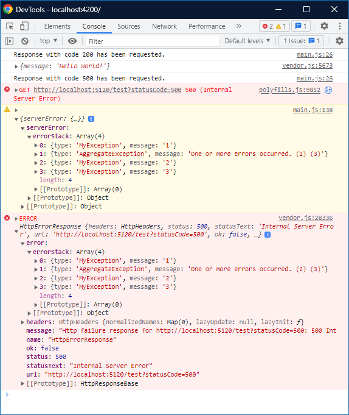

# NetNg.ErrorHandling

## Demo




## Endpoint
```c#
public class TestController : ApiControllerBase
{
    [HttpGet]
    public IActionResult Index(int statusCode = 200)
    {
        return statusCode switch
        {
            200 => Json(new
            {
                Message = "Hello World!",
            }),
            400 => BadRequest(),
            401 => Unauthorized(),
            403 => Forbid(),
            _ => throw
                new MyException("1",
                    new AggregateException(
                        new MyException("2"),
                        new MyException("3"))),
        };
    }
}
```

## ErrorController
```c#
[ApiExplorerSettings(IgnoreApi = true)]
public class ErrorController : ApiControllerBase
{
    public ObjectResult Index()
    {
        var exceptionHandlerFeature = HttpContext.Features.Get<IExceptionHandlerFeature>();
        var error = exceptionHandlerFeature.Error;
        var errorModel = new ErrorModel(error);

        return new ObjectResult(errorModel)
        {
            StatusCode = 500,
        };
    }
}
```

## ServerErrorInterceptor
```ts
@Injectable()
export class ServerErrorInterceptor implements HttpInterceptor {
  intercept(request: HttpRequest<unknown>, next: HttpHandler): Observable<HttpEvent<unknown>> {

    return next.handle(request)
      .pipe(
        catchError((httpErrorResponse: HttpErrorResponse) => {
          if (httpErrorResponse.status === 500) {
            const serverError = httpErrorResponse.error as IServerErrorModel;

            // as a service
            console.warn({serverError});
          }

          return throwError(() => httpErrorResponse);
        }),
      );
  }
}
```